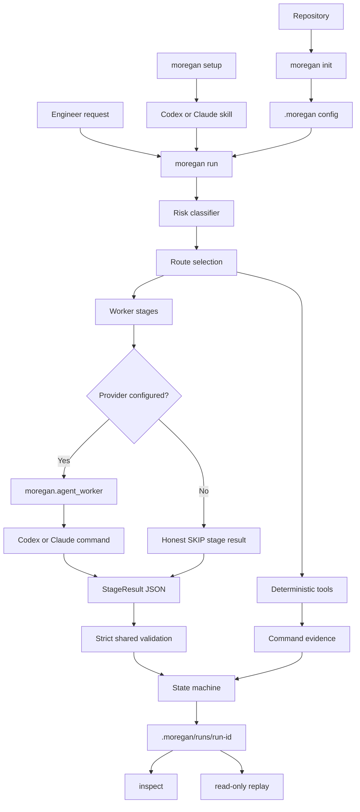

# MoreGAN

[](https://github.com/suyesh/moregan/actions/workflows/workflow.yml)

<p align="center">
  
</p>

<p align="center">
  <strong>Adversarial orchestration for coding agents.</strong><br>
  Generator builds. Evaluators attack. The runtime keeps the evidence.
</p>

MoreGAN is a local, evidence-first harness for Claude Code, Codex, and other coding-agent workflows. It separates implementation from independent verification, records deterministic evidence, routes tasks by risk, and writes inspectable run traces that engineers can replay.

The loop is simple:

```text
request -> route by risk -> worker stages -> deterministic checks -> trace -> replay
```

MoreGAN is not a magic prompt. It is an executable runtime where Python enforces the protocol and agents are replaceable workers behind a structured `StageResult` contract.

## Why GAN

GAN means **Generative Adversarial Network**. MoreGAN borrows the useful engineering idea from GANs, not the machine-learning training algorithm:

- a generator proposes the implementation
- evaluators attack the change from functional, security, review, and production angles
- deterministic tools provide hard evidence from tests, syntax checks, git diff checks, and repo-local commands
- the runtime decides pass, fail, or incomplete from structured results instead of trusting prose

## Architecture



## Engineer Value

- Enforced workflow instead of hoping an agent remembers every instruction.
- Structured findings, evidence, confidence, and verdicts for each stage.
- Deterministic checks for tests, syntax, git diff validation, and repo-local commands.
- Adaptive routing that combines request keywords with repository diff evidence.
- Stack-aware deterministic presets for Python, Node, Java/Spring Boot, Rails/Ruby, Go, and Rust projects.
- Bounded remediation attempts that feed failed findings back to the generator.
- Isolated execution for no-write worker stages by default.
- Compact context packs that keep worker prompts smaller while preserving useful run context.
- Empirical learning artifacts that tie observations to run ids, failures, remediations, and outcomes.
- Read-only replay of past runs without rerunning providers or tests.
- Isolated benchmark fixtures with independent acceptance checks and baseline comparisons.
- Codex and Claude adapter templates that normalize provider output into JSON.
- Local trace artifacts under `.moregan/runs/` for debugging and review.
- Honest dry-run stage results when no agent provider command is configured.

## Requirements

- Python 3.8 or newer for the CLI runtime and installer
- macOS, Linux, or Windows
- Codex or Claude Code only when using the installed skill or provider-backed workers
- Optional: `uv` for source-checkout development

Codex and Claude can read the installed skill instructions directly. The executable runtime still runs locally through Python.

## Install

Public install after the first PyPI release is published:

```bash
python3 -m pip install moregan
moregan setup
```

`moregan setup` runs the same installer flow as `./setup.sh`. It installs the MoreGAN skill into Claude Code, Codex, or both.

To install a specific target:

```bash
moregan setup --target codex
moregan setup --target claude
moregan setup --target both
```

Source checkout install, useful before the first PyPI release or while developing MoreGAN itself:

```bash
git clone https://github.com/suyesh/moregan.git
cd moregan
./setup.sh
```

Windows:

```bat
setup.bat
```

Source checkout development:

```bash
uv sync
uv run moregan --help
```

When running from a source checkout, prefix CLI examples with `uv run`, for example `uv run moregan init`.

The installer copies:

- `SKILL.md`
- persona instructions
- `assets/` and `LICENSE`
- `.moregan/` defaults
- `moregan/` executable runtime package
- maintenance commands for update and doctor

## First Run

Initialize a repository:

```bash
moregan init
```

From a source checkout:

```bash
uv run moregan init
```

This creates:

```text
.moregan/
  tools.yaml
  workers.yaml
  runs/
  learning/
```

It also ignores local run, learning, and benchmark output directories in `.gitignore`. Existing config is preserved unless `--force` is passed.

Run MoreGAN:

```bash
moregan run "Add OAuth login"
```

Risk routing uses both the request and local repository evidence. Auth, payments, migrations, dependency files, infrastructure files, public API paths, broad diffs, and large line changes can raise the route even when the request sounds small.

Inspect the latest run:

```bash
moregan status
moregan inspect latest
moregan replay latest
moregan replay latest --json
```

## Runtime Commands

Installed CLI:

```bash
moregan init
moregan setup
moregan setup doctor --check
moregan setup update
moregan adapters codex
moregan adapters claude
moregan run "Refactor the payment service"
moregan status
moregan inspect latest
moregan replay latest
```

Source checkout:

```bash
uv run moregan init
uv run moregan run "Refactor the payment service"
uv run moregan inspect latest
```

Useful flags:

```bash
moregan init --dry-run
moregan init --force
moregan adapters codex --activate
moregan adapters claude --activate
moregan run "Change button copy" --no-checks
moregan run "Fix checkout bug" --max-remediation-attempts 1
```

## Agent Adapters

Scaffold provider templates:

```bash
moregan adapters codex
moregan adapters claude
```

This writes:

```text
.moregan/
  adapters/
    codex/
      README.md
      generator.md
      evaluator.md
      ...
    claude/
      README.md
      generator.md
      evaluator.md
      ...
  workers.codex.yaml
  workers.claude.yaml
```

Activate one provider:

```bash
moregan adapters codex --activate
```

Then set a provider command that reads a prompt from stdin and prints one `StageResult` JSON object:

```bash
export MOREGAN_CODEX_COMMAND="<your codex command>"
export MOREGAN_CLAUDE_COMMAND="<your claude command>"
```

Review and evaluation workers default to no-write mode. The generator stage is write-enabled when activated.

Worker execution modes:

```yaml
execution: auto        # no-write workers run in isolated snapshots; write-enabled workers run in the repo
execution: isolated    # always run in a temporary repository snapshot
execution: repository  # run in the real checkout
```

MoreGAN passes `MOREGAN_EXECUTION_MODE` and `MOREGAN_EXECUTION_ROOT` to provider commands and records the execution context in stage evidence. If a `no_write: true` worker is forced to `execution: repository` and changes the git status, MoreGAN fails that stage with a `no_write_violation` finding.

MoreGAN also passes compact context instead of oversized inline history:

```text
MOREGAN_CONTEXT_PACK=/path/to/.moregan/runs/<run-id>/context/stages/generator.attempt1.json
MOREGAN_CONTEXT_TOKENS=1234
```

Provider commands can read `MOREGAN_CONTEXT_PACK` when they need the current request, route, repository summary, prior stage findings, deterministic evidence, remediation context, and local lessons.

## Worker Contract

Workers must print one JSON object:

```json
{
  "stage": "generator",
  "verdict": "pass",
  "confidence": 0.9,
  "findings": [],
  "evidence": [
    {
      "kind": "worker",
      "name": "summary",
      "summary": "Implemented the requested change and ran tests."
    }
  ]
}
```

Valid verdicts:

- `pass`
- `fail`
- `skip`

Blocking issues should use `fail` with concrete findings and remediation.
Critical or high findings cannot accompany `pass` or `skip`.

Both direct workers and Codex/Claude adapters use the same strict validator:
`stage` must match the requested worker, and `confidence` must be a finite number
from 0 to 1, not a string or boolean. Findings and evidence can be omitted as empty
lists; when supplied, every entry must be valid. Unknown fields, duplicate JSON
keys, malformed entries, markdown fences, and surrounding prose are rejected.
MoreGAN owns attempt numbers and timing; providers cannot override them.

A finding has this shape:

```json
{
  "severity": "high",
  "category": "missing_test_coverage",
  "description": "The changed payment branch has no regression test.",
  "remediation": "Add a test that fails before the fix and passes after it.",
  "file": "tests/test_payments.py",
  "line": 42
}
```

Finding severity is `critical`, `high`, `medium`, `low`, or `info`. Category,
description, and remediation must be nonempty strings. File is a nonempty string
or null; line is a positive integer or null. Evidence requires nonempty `kind`,
`name`, and `summary`, with optional `path` and a string-argument `command` list.

## Run Outcomes

| Outcome | Meaning | `moregan run` Exit Code |
|---|---|---|
| `pass` | Every routed worker passed; at least one deterministic check ran; no required check failed | 0 |
| `fail` | A blocking check, worker, provider, or worker configuration failed | 1 |
| `incomplete` | No blocking failure, but a routed worker or the entire evidence gate was skipped | 1 |

`--no-checks`, missing providers, and empty or entirely skipped check lists cannot
produce a pass. Individual not-applicable checks may skip when another check ran;
optional check failures remain nonblocking. Configure checks as `required: true`
when they must gate completion. A pass reflects the configured gates, not proof
of production readiness.

The CLI lists incomplete stages; `result.json`, state history, and reports retain
the outcome. Incomplete runs do not earn successful-remediation learning credit.
`status`, `inspect`, and `replay` are read-only commands: successful inspection
returns 0 even when the stored run failed or is incomplete.

## Deterministic Tools

Configure deterministic checks in `.moregan/tools.yaml`:

```yaml
version: 1
commands:
  - name: git_diff_check
    builtin: git_diff_check
    category: git
    required: true
    remediation: "Fix whitespace or conflict-marker issues reported by git diff --check."

  - name: unit_tests
    builtin: unit_tests
    category: tests
    required: true
    remediation: "Fix failing tests or update tests only when requirements changed intentionally."
```

MoreGAN can also run explicit commands:

```yaml
version: 1
commands:
  - name: npm_test
    command: ["npm", "test"]
    category: tests
    required: true
    remediation: "Fix failing npm tests."
```

Optional checks record findings without blocking the run:

```yaml
required: false
```

`moregan init` detects common stacks and writes optional enabled presets when matching project files exist:

- Python: `pytest`, `ruff`, `mypy`, `bandit`, `pip-audit`
- Node: `npm test`, `npm run lint`, `npm run typecheck`, `npm audit`
- Java/Spring Boot: Maven or Gradle tests, Checkstyle, SpotBugs, PMD, OWASP Dependency-Check
- Rails/Ruby: `rspec`, `rubocop`, `brakeman`, `bundle-audit`
- Go: `go test`, `go vet`, `staticcheck`
- Rust: `cargo test`, `cargo clippy`, `cargo audit`

Optional presets skip cleanly when their executable is not installed.

## Trace Artifacts

Each run writes a directory like this. The exact `stages/*.json` files depend on the risk route:

```text
.moregan/runs/<run-id>/
  request.json
  plan.json
  risk.json
  state.json
  states.jsonl
  tool_suggestions.json
  context/
    manifest.json
    base.json
    stages/
      generator.attempt1.json
      evaluator.attempt1.json
  stages/
    risk_classifier.json
    generator.json
    generator.attempt1.json
    generator.attempt2.json
    deterministic_evidence.json
    deterministic_evidence.attempt1.json
    deterministic_evidence.attempt2.json
    evaluator.json
    ...
  events.jsonl
  result.json
  final_report.md
```

Replay is read-only:

```bash
moregan replay latest
```

It reconstructs state transitions, stage results, findings, and deterministic evidence from existing files. It does not rerun providers or tests.

When a required deterministic check or routed worker fails after generation, MoreGAN transitions through `remediation`, passes a structured remediation context to the generator, and retries from deterministic evidence when practical. The default limit is three remediation attempts.

Remediation runs also write `remediation.json` plus attempt-specific stage files such as `generator.attempt2.json`.

Context packs are capped JSON summaries designed to preserve useful context without spending tokens on full trace history. `context/manifest.json` records every pack path, byte size, and approximate token count.

Learning is evidence-backed. Each run writes `learning.json`; failures and remediations append observations to `.moregan/learning/observations.jsonl`, and aggregate confidence stats are written to `.moregan/learning/patterns.json`. Clean runs do not invent lessons.

## Skill Usage

Claude Code:

```bash
/moregan "Add user authentication with JWT"
/moregan update
/moregan doctor
```

Codex:

```text
Use MoreGAN to add user authentication with JWT
Use MoreGAN to update
Use MoreGAN to run doctor
```

Maintenance:

- `moregan setup update` downloads the latest MoreGAN archive from GitHub and reinstalls existing targets.
- `moregan setup doctor --check` reports duplicate installs, stale persona files, registry duplication, and missing files.
- `/moregan update` and `/moregan doctor` remain available as Claude Code skill commands.

## Skill vs Runtime

MoreGAN has two execution modes:

- Skill-only mode: Codex or Claude reads `SKILL.md` and the persona files, then follows the MoreGAN workflow inside the agent session. Personas are used automatically in this mode, but enforcement depends on the agent following the instructions.
- Runtime mode: `moregan run ...` enforces routing, state, traces, retries, deterministic checks, context packs, and learning artifacts in Python. Persona stages execute only when `.moregan/workers.yaml` points at a provider command.

To make runtime persona stages execute through Codex or Claude:

```bash
moregan adapters codex --activate
export MOREGAN_CODEX_COMMAND='<command that reads prompt stdin and returns StageResult JSON>'
moregan run "Add OAuth login"
```

Without a provider command, runtime stages produce honest `SKIP` results instead of pretending a persona ran.

## PyPI Trusted Publishing

This repository includes a GitHub Actions trusted-publishing workflow:

```text
.github/workflows/workflow.yml
```

Use these values in PyPI:

```text
Owner: suyesh
Repository name: moregan
Workflow filename: workflow.yml
Environment name: pypi
PyPI project name: moregan
```

The package name in `pyproject.toml` is `moregan`. The workflow uses GitHub OIDC with `id-token: write` and `pypa/gh-action-pypi-publish`.

## Benchmarks

After configuring a provider, compare its generator alone with the MoreGAN route:

```bash
moregan benchmark init
moregan benchmark run --mode baseline
moregan benchmark run --mode moregan
moregan benchmark compare <baseline-run-id> <moregan-run-id>
moregan benchmark inspect latest
```

Six small Python fixtures cover bugs, features, refactors, security, migrations,
and regressions. Each task uses a fresh temporary workspace and independent
acceptance tests. Git is required to initialize fixture repositories. Missing
workers and provider errors remain unmeasured. Reports
show coverage and leave unavailable token/cost metrics null. These starter tasks
do not establish production effectiveness.

See [the benchmark guide](docs/benchmarks.md) for custom suites, external baseline
imports, artifacts, and comparison rules.

## Current Limitations

MoreGAN is alpha. Risk includes the diff present at intake, but is not yet
reassessed after a generator writes changes. Deterministic command timeouts,
bounded subprocess output, replay attempt fidelity, snapshot cleanup, and stronger
process isolation still need work. Provider results are validated structurally;
validation cannot establish whether a model's claims are true. See
[the review and next fixes](docs/review-2026-09-27.md).

## Roadmap

Implemented in this repository:

- Full rename to MoreGAN and `.moregan/`
- `moregan init`
- structured runtime schemas
- state machine
- deterministic tool layer
- provider-backed worker command contract
- bounded remediation loop
- compact context packs for token-aware worker execution
- empirical learning observations and pattern statistics
- diff-aware adaptive routing
- stack-aware deterministic tool presets
- run replay
- Codex and Claude adapter templates
- PyPI trusted-publishing workflow
- PyPI-ready package metadata
- `moregan setup` installer bridge
- isolated benchmark runner, baseline execution, and paired comparisons
- truthful incomplete outcomes and strict shared provider validation

Next production-readiness work:

- post-generation risk reassessment
- larger benchmark suites and repeated live-agent measurements
- bounded tool execution and replay attempt fidelity
- stronger sandboxing for provider-backed workers
- stricter config validation and doctor checks
- competitive generator mode
- first release publishing and `uvx` smoke testing

See [ROADMAP.md](ROADMAP.md) for the detailed plan.

## Development

Run tests:

```bash
python3 -m unittest discover -s tests -v
```

Compile Python files:

```bash
python3 -m py_compile install.py tests/test_install.py tests/test_moregan_runtime.py moregan/*.py
```

Check diff hygiene:

```bash
git diff --check
```

Dogfood the runtime:

```bash
uv run moregan run "Verify MoreGAN runtime"
uv run moregan replay latest
```

## License

MIT. See [LICENSE](LICENSE).

## References

- [Anthropic: Effective Harnesses for Long-Running Agents](https://www.anthropic.com/engineering/effective-harnesses-for-long-running-agents)
- [Anthropic: Building Effective Agents](https://www.anthropic.com/engineering/building-effective-agents)
- [PyPI Trusted Publishing](https://docs.pypi.org/trusted-publishers/using-a-publisher/)
- [PyPI Trusted Publisher Setup](https://docs.pypi.org/trusted-publishers/adding-a-publisher/)
