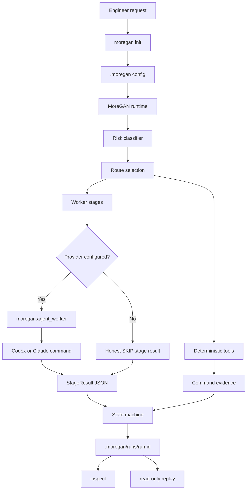

# MoreGAN

<p align="center">
  
</p>

<p align="center">
  <strong>Adversarial orchestration for coding agents.</strong><br>
  Generator builds. Evaluators attack. The runtime keeps the evidence.
</p>

MoreGAN is a local harness for Claude Code, Codex, and other coding-agent workflows. It separates implementation from independent verification, records deterministic evidence, routes tasks by risk, and writes inspectable run traces that engineers can replay.

The core idea is simple:

```text
request -> route by risk -> worker stages -> deterministic checks -> trace -> replay
```

MoreGAN is not trying to be a magic prompt. The direction is an executable runtime where Python enforces the protocol and agents are replaceable workers behind a structured `StageResult` contract.

## Architecture



The original architecture sketch is still in the repository as `Architecture.jpg`, but the Mermaid diagram above is the current runtime shape.

## Why Engineers Use It

- Enforced workflow instead of hoping an agent remembers every instruction.
- Structured findings, evidence, confidence, and verdicts for each stage.
- Deterministic checks for tests, syntax, git diff validation, and repo-local tools.
- Read-only replay of past runs without rerunning providers or tests.
- Codex and Claude adapter templates that normalize provider output into JSON.
- Local trace artifacts under `.moregan/runs/` for debugging and review.

## Requirements

- Python 3.8 or newer
- macOS, Linux, or Windows
- Codex or Claude Code for skill usage
- Optional: `uv` for local dependency management

Codex and Claude can read the installed skill instructions directly. The executable runtime commands need local Python.

## Install

Clone the repository:

```bash
git clone https://github.com/suyesh/moregan.git
cd moregan
```

Install the skill into Claude Code, Codex, or both:

```bash
./setup.sh
```

Windows:

```bat
setup.bat
```

Manual local setup:

```bash
uv sync
python -m moregan.cli --help
```

The installer copies:

- `SKILL.md`
- persona instructions
- `.moregan/` defaults
- `moregan/` executable runtime package
- maintenance commands for update and doctor

## First Run

Initialize a repository:

```bash
python -m moregan.cli init
```

This creates:

```text
.moregan/
  tools.yaml
  workers.yaml
  runs/
```

It also adds `.moregan/runs/` to `.gitignore`. Existing config is preserved unless `--force` is passed.

Run MoreGAN:

```bash
python -m moregan.cli run "Add OAuth login"
```

Inspect the latest run:

```bash
python -m moregan.cli status
python -m moregan.cli inspect latest
python -m moregan.cli replay latest
python -m moregan.cli replay latest --json
```

## Runtime Commands

```bash
python -m moregan.cli init
python -m moregan.cli adapters codex
python -m moregan.cli adapters claude
python -m moregan.cli run "Refactor the payment service"
python -m moregan.cli status
python -m moregan.cli inspect latest
python -m moregan.cli replay latest
```

Useful flags:

```bash
python -m moregan.cli init --dry-run
python -m moregan.cli init --force
python -m moregan.cli adapters codex --activate
python -m moregan.cli adapters claude --activate
python -m moregan.cli run "Change button copy" --no-checks
```

## Codex And Claude Adapters

Scaffold provider templates:

```bash
python -m moregan.cli adapters codex
python -m moregan.cli adapters claude
```

This writes:

```text
.moregan/
  adapters/
    codex/
      README.md
      generator.md
      evaluator.md
      ...
    claude/
      README.md
      generator.md
      evaluator.md
      ...
  workers.codex.yaml
  workers.claude.yaml
```

Activate one provider:

```bash
python -m moregan.cli adapters codex --activate
```

Then set a provider command that reads a prompt from stdin and prints one `StageResult` JSON object:

```bash
export MOREGAN_CODEX_COMMAND="<your codex command>"
export MOREGAN_CLAUDE_COMMAND="<your claude command>"
```

Review and evaluation workers default to no-write mode. The generator stage is write-enabled when activated.

## Worker Contract

Workers must print one JSON object:

```json
{
  "stage": "generator",
  "verdict": "pass",
  "confidence": 0.9,
  "findings": [],
  "evidence": [
    {
      "kind": "worker",
      "name": "summary",
      "summary": "Implemented the requested change and ran tests."
    }
  ]
}
```

Valid verdicts:

- `pass`
- `fail`
- `skip`

Blocking issues should use `fail` with concrete findings and remediation.

## Deterministic Tools

Configure deterministic checks in `.moregan/tools.yaml`:

```yaml
version: 1
commands:
  - name: git_diff_check
    builtin: git_diff_check
    category: git
    required: true
    remediation: "Fix whitespace or conflict-marker issues reported by git diff --check."

  - name: unit_tests
    builtin: unit_tests
    category: tests
    required: true
    remediation: "Fix failing tests or update tests only when requirements changed intentionally."
```

MoreGAN can also run explicit commands:

```yaml
version: 1
commands:
  - name: npm_test
    command: ["npm", "test"]
    category: tests
    required: true
    remediation: "Fix failing npm tests."
```

Optional checks record findings without blocking the run:

```yaml
required: false
```

## Trace Artifacts

Each run writes:

```text
.moregan/runs/<run-id>/
  request.json
  plan.json
  risk.json
  state.json
  states.jsonl
  tool_suggestions.json
  stages/
    risk_classifier.json
    generator.json
    deterministic_evidence.json
    evaluator.json
  events.jsonl
  result.json
  final_report.md
```

Replay is read-only:

```bash
python -m moregan.cli replay latest
```

It reconstructs state transitions, stage results, findings, and deterministic evidence from existing files. It does not rerun providers or tests.

## Skill Usage

Claude Code:

```bash
/moregan "Add user authentication with JWT"
/moregan update
/moregan doctor
```

Codex:

```text
Use MoreGAN to add user authentication with JWT
Use MoreGAN to update
Use MoreGAN to run doctor
```

Maintenance:

- `update` downloads the latest MoreGAN archive from GitHub and reinstalls existing targets.
- `doctor` checks duplicate installs, stale persona files, registry duplication, and missing files.

## PyPI Trusted Publishing

This repository includes a GitHub Actions trusted-publishing workflow:

```text
.github/workflows/workflow.yml
```

Use these values in PyPI:

```text
Owner: suyesh
Repository name: moregan
Workflow filename: workflow.yml
Environment name: pypi
```

The workflow uses GitHub OIDC with `id-token: write` and `pypa/gh-action-pypi-publish`.

## Roadmap

Implemented on the current branch:

- Full rename to MoreGAN and `.moregan/`
- `moregan init`
- structured runtime schemas
- state machine
- deterministic tool layer
- provider-backed worker command contract
- run replay
- Codex and Claude adapter templates
- PyPI trusted-publishing workflow

Next production-readiness work:

- remediation loop
- safer execution model with isolated worktrees
- stricter config validation and doctor checks
- stack-specific deterministic tool presets
- benchmark suite
- packaging cleanup for PyPI and `uvx` usage

See [ROADMAP.md](ROADMAP.md) for the detailed plan.

## Development

Run tests:

```bash
python3 -m unittest discover -s tests -v
```

Compile Python files:

```bash
python3 -m py_compile install.py tests/test_install.py tests/test_moregan_runtime.py moregan/*.py
```

Check diff hygiene:

```bash
git diff --check
```

Dogfood the runtime:

```bash
python3 -m moregan.cli run "Verify MoreGAN runtime"
python3 -m moregan.cli replay latest
```

## License

MIT. See [LICENSE](LICENSE).

## References

- [Anthropic: Effective Harnesses for Long-Running Agents](https://www.anthropic.com/engineering/effective-harnesses-for-long-running-agents)
- [Anthropic: Building Effective Agents](https://www.anthropic.com/engineering/building-effective-agents)
- [PyPI Trusted Publishing](https://docs.pypi.org/trusted-publishers/using-a-publisher/)
- [PyPI Trusted Publisher Setup](https://docs.pypi.org/trusted-publishers/adding-a-publisher/)
